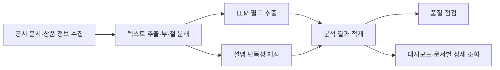

# BOAZ Signal

**금융상품 설명서의 이해하기 어려운 부분을 데이터로 분석합니다.**

BOAZ Signal은 판매 중인 금융상품 설명서를 수집·분석해, 설명서의 부·절(설명서 목차의 부와 그 아래 절)마다 설명 난독성 점수를 산출하는 프로젝트 팀입니다. 같은 상품군·위험등급 안에서 설명 난도가 어떻게 다른지 비교하고, 분석 결과를 근거로 비대면 가입 절차 개선안을 작성합니다.

프로젝트 주제는 **금융상품 설명 리스크 진단 파이프라인**입니다.

## 저장소 안내

| 저장소 | 역할 | 처음 볼 문서 |
|---|---|---|
| [signal-pipeline](https://github.com/BOAZ-Signal-Team-26/signal-pipeline) | 데이터 설계, 원천 데이터 검증, 수집·파싱·채점·추출 코드(9월 30일 기준 폴더 구조만 준비) | [설계 문서 안내](https://github.com/BOAZ-Signal-Team-26/signal-pipeline/blob/main/docs/README.md) |
| [signal-infra](https://github.com/BOAZ-Signal-Team-26/signal-infra) | 클라우드 리소스, 네트워크와 환경 설정, 배포 구성(클라우드 설계 승인 후 추가) | [인프라 범위](https://github.com/BOAZ-Signal-Team-26/signal-infra/blob/main/README.md) |
| [Project-Management](https://github.com/BOAZ-Signal-Team-26/Project-Management) | 일정, 작업 분해(WBS), 스프린트 계획, 팀 운영 규칙 | [프로젝트 안내](https://github.com/BOAZ-Signal-Team-26/Project-Management/blob/main/README.md) |

읽는 순서는 맡은 일에 따라 다릅니다.

| 목적 | 순서 |
|---|---|
| 설계 파악 | [설계 문서 안내](https://github.com/BOAZ-Signal-Team-26/signal-pipeline/blob/main/docs/README.md) → [데이터 모델](https://github.com/BOAZ-Signal-Team-26/signal-pipeline/blob/main/docs/data-model.md) → [데이터 소스 수집 명세](https://github.com/BOAZ-Signal-Team-26/signal-pipeline/blob/main/docs/data-sources.md) |
| 계획·일정 파악 | [프로젝트 안내](https://github.com/BOAZ-Signal-Team-26/Project-Management/blob/main/README.md) → [일정](https://github.com/BOAZ-Signal-Team-26/Project-Management/blob/main/docs/05-timeline.md) → [작업 범위와 WBS](https://github.com/BOAZ-Signal-Team-26/Project-Management/blob/main/docs/06-wbs.md) |

## 작업 방법

| 항목 | 규칙 |
|---|---|
| 브랜치 | 저장소마다 `main`과 `dev`를 둡니다. `main`에는 PR로만 반영합니다 |
| `main` 반영 조건 | 자동 검사(CI) 통과, PR 리뷰 대화 전부 해결. 승인 인원은 0명이며 관리자에게도 같은 조건을 적용합니다 |
| `dev` | 직접 푸시할 수 있습니다 |
| 자동 리뷰 | CodeRabbit이 `main`·`dev` 대상 PR을 한국어로 리뷰합니다 |
| PR 본문 | 각 저장소의 `.github/PULL_REQUEST_TEMPLATE.md` 형식을 따릅니다 |
| 문서 작성 규칙 | [문서 작성 지침](https://github.com/BOAZ-Signal-Team-26/Project-Management/blob/main/agents/tpm-doc-ko.md). 각 저장소의 `CLAUDE.md`에 요약이 있습니다 |

PR 규칙의 근거와 아직 정하지 않은 규칙(브랜치 이름, 커밋 메시지 형식 등)은 [팀 운영 규칙](https://github.com/BOAZ-Signal-Team-26/Project-Management/blob/main/docs/04-proposals.md)에 있습니다.

> **모든 저장소는 공개 저장소입니다.** API 키, `.env`, 원본 PDF와 가공 데이터(`raw/`, `derived/`, `runs/`), 1MB를 넘는 파일은 커밋하지 않습니다. 저장소를 받은 뒤 커밋 전 검사를 한 번 설치합니다(`uv run pre-commit install`). 개발 환경 설정은 [signal-pipeline README](https://github.com/BOAZ-Signal-Team-26/signal-pipeline/blob/main/README.md)에 있습니다.

## 산출물

| 산출물 | 내용 |
|---|---|
| 전수 채점 파이프라인 | 대상 설명서를 수집하고, 텍스트를 추출해 부·절별 설명 난독성을 채점합니다 |
| 설명 난독성 대시보드 | 상품별 점수 분포를 비교합니다. 설명서 1건의 부·절별 점수와 감점 사유는 대시보드 상세 화면에서 확인합니다 |
| 비대면 가입 절차 개선안 | 펀드·ELS의 앱 가입 절차를 실측하고, 설명 방식과 정보 제시 순서의 개선 항목을 도출합니다 |
| 파이프라인 문서 | 아키텍처 다이어그램, 데이터베이스 Schema, 데이터 품질 리포트를 정리합니다 |

원천 데이터부터 채점 근거까지 추적할 수 있도록 데이터 구조를 설계하고, 수집·파싱 실패와 계산 불가 사유도 기록합니다.

> 9월 30일 기준으로 데이터 설계와 원천 데이터 검증 단계입니다. 위 산출물은 개발 목표이며, 단계별 진행 상황은 [설계 문서 안내](https://github.com/BOAZ-Signal-Team-26/signal-pipeline/blob/main/docs/README.md)에 있습니다.

## 분석 범위

| 상품군 | 설명 난독성 채점 | 가입 절차 개선안 |
|---|:---:|:---:|
| 공모펀드 | 대상 | 대상 |
| ETF | 대상 | 제외 |
| ELS | 제외 | 대상 |

**CDI(설명 난독성 지표)** 는 값이 높을수록 설명이 어렵다는 뜻이며, 같은 상품군·같은 위험등급의 비교 집단 안에서 해석합니다. 채점은 설명서의 부·절 단위로 하고, 통계는 펀드 단위로 집계합니다.

CDI는 아래 4축으로 구성합니다. 축별 변수와 산식, 배점은 검토 중입니다.

| CDI 4축 | 확인하려는 것 |
|---|---|
| 언어 복잡도 | 문장 길이 등 읽기에 부담을 주는 언어적 특성 |
| 용어 부담 | 전문용어의 비중과 용어 설명 여부 |
| 구조 접근성 | 필요한 정보를 찾기 쉬운지, 문서 구성과 참조 방식이 적절한지 |
| 고지 충실도 | 상품에 적용되는 설명 항목이 문서에 포함되어 있는지 |

검토 중인 항목은 다음과 같습니다.

- 고지 충실도를 CDI에 합칠지, 별도 점수로 보고할지, 어떤 상품군에 적용할지
- 사람의 이해도 평가와 LLM 평가를 함께 쓰는 검증 방식
- 분쟁·제재 자료를 검증과 사례 탐색에 활용하는 범위

평가 단위와 비교 기준은 [점수 저장과 비교 모집단](https://github.com/BOAZ-Signal-Team-26/signal-pipeline/blob/main/docs/scoring-and-population.md)에 있습니다.

## 데이터 파이프라인 Flow

품질 점검에서는 수집·파싱·추출 단계의 누락률, 실패율, 일관성을 확인합니다. 원천 데이터, 가공 데이터, 분석 결과는 구분해 저장합니다.

| 데이터 소스 | 활용 |
|---|---|
| DART | 투자설명서 원문과 공시 정보 확보 |
| 금융투자협회 전자공시 | 펀드 공시·첨부 문서, 판매회사와 펀드의 관계 확인 |
| 공공데이터포털 펀드상품기본정보 | 펀드 코드와 기본정보를 이용한 소스 간 연결 |
| KRX | ETF 식별과 일별 목록 확인 |
| 금융감독원 | 제재·경영유의사항과 분쟁조정 사례의 검증·탐색 활용 검토 |

수집 방식과 실측 근거는 [데이터 소스 수집 명세](https://github.com/BOAZ-Signal-Team-26/signal-pipeline/blob/main/docs/data-sources.md)에 있습니다.

## 팀

| 역할 |
|---|
| PM(대현) |
| 분석·리서치(민석) |
| 데이터 사이언스(다빈) |
| 데이터 엔지니어링·인프라(주영) |

2주 단위 스프린트로 진행하고, 정례 미팅은 매주 수요일 20:30입니다.
